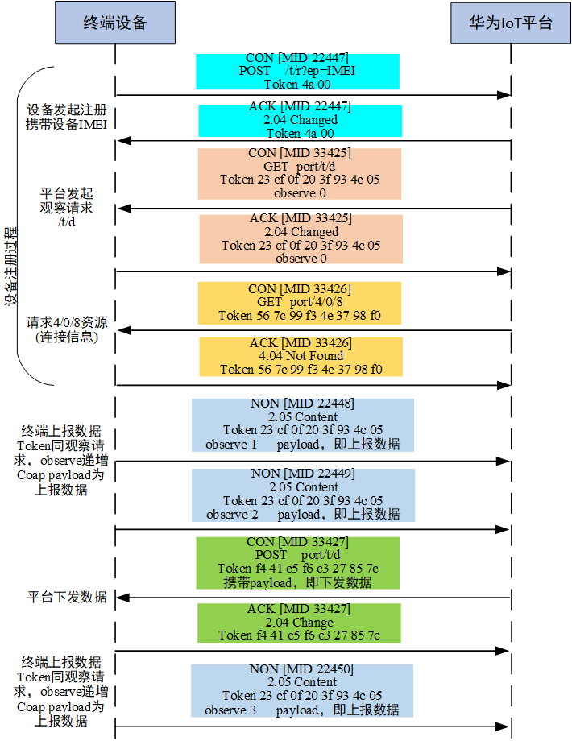
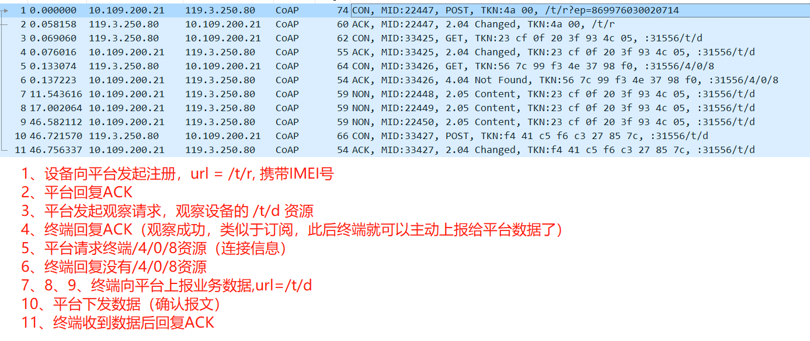
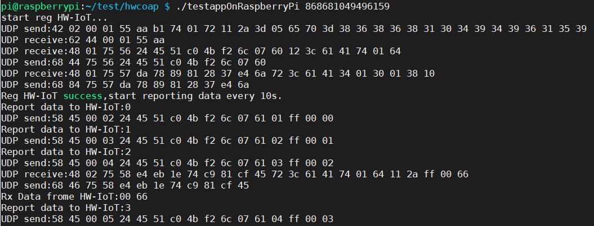

# hwcoap——A simple coap component for connecting to Huawei's IoT platform.
一个非常非常简单的对接华为IoT平台coap组件实现，使用者只需要实现UDP的收发函数和一个延时函数即可。
作者通过wireshark抓包分析了华为IoT COAP协议对接的过程，代码中只是通过UDP封包的形式简单实现了对接平台的功能，力求简单，略显粗糙，但也足够一般场景使用了。只要你的平台支持udp通信，那么就可以使用该代码来和华为IoT通信了，没必要用复杂且占用空间的MQTT协议。
代码运行中使用的发送和接送的缓存空间都是由用户先申请的，可根据自己的情况创建一个数据。我测试使用的只有1K的RAM，收发Buffer分别是512B，如果发送和接收的数据量不大，也可以将RAM设置为256B。如果发送和接收在同一个线程，那么可以将发送和接收Buffer设置为同一个，节省RAM。

# 华为IoT平台对接流程
下边通过两幅图片展示了华为IoT COAP协议对接的流程，本次代码也是根据该流程实现的。
具体分析过程可以csdn查看博客: [抓包分析华为IOT平台CoAP对接流程](https://blog.csdn.net/llb19900510/article/details/107913255)。



# 使用说明
## 文件说明
* hwcoap.c 代码实现
* hwcoap.h 头文件，用户程序中包含
* test.c   在linux下实现的一个测试程序
* testapplication 在树莓派上编译出来的应用程序
## 使用方法
1. 将hwcoap.c加入用户工程中，在应用程序中包含头文件hwcoap.h。
2. 在用户程序中实现hwcoap.h中定义的三个接口：udp的收发函数和一个延时函数。
    ```c
    /*
    brief: send data through udp.
    paras: data: data to be sent
            len: data length to be sent
    return: 0-success , other -failed
    */
    uint8_t UDP_Send(uint8_t *data,uint16_t len);
    /*
    brief: receive data through udp.
    paras: data,receive buffer
            maxLen, max length of receiving buff.
    return: receiving data length. 
    */
    uint16_t UDP_Receive(uint8_t *data,uint16_t maxLen);
    /*
    brief: delay some time. unit:ms
    */
    void  DelayMs(uint16_t ms);
    ```
3. 用户程序调用```cHWRegisterWithCoap(char *ep,uint8_t epLen)```向平台发起注册，需要传入设备IMEI(需要现在IoT平台创建好profile并添加设备)和IMEI的长度；
通过```cHWReportData(uint8_t *data,uint16_t len)```接口向平台上报数据；
通过```cuint16_t HWProcessRxData(uint8_t *data,uint16_t maxLen)```接收平台下发的数据。

# Demo使用
test.c是在linux下实现的一个测试程序,在linux环境下执行make即可生成testapp应用程序:
```sh
./testapp 868681049496159
```
其中868681049496159为我在平台上注册的设备的识别号(IMEI)，需要根据自己的设备来进行修改。

testapplication 在树莓派上编译出来的应用程序，其运行效果如下图：

